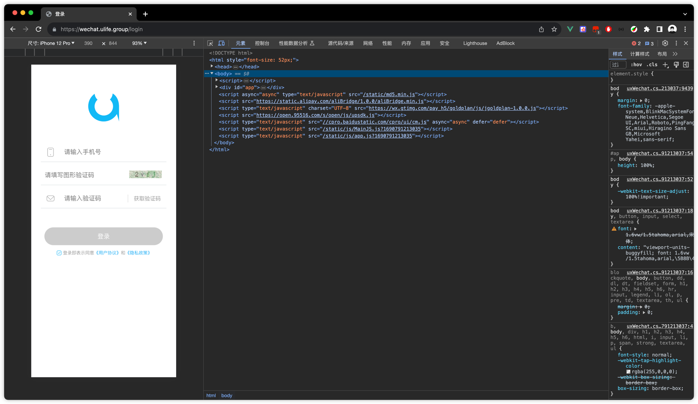
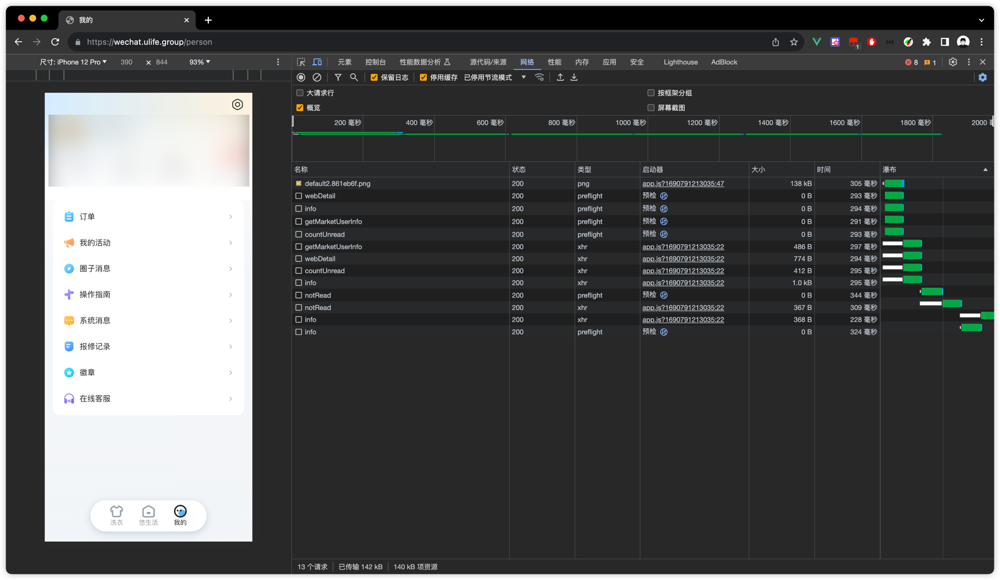
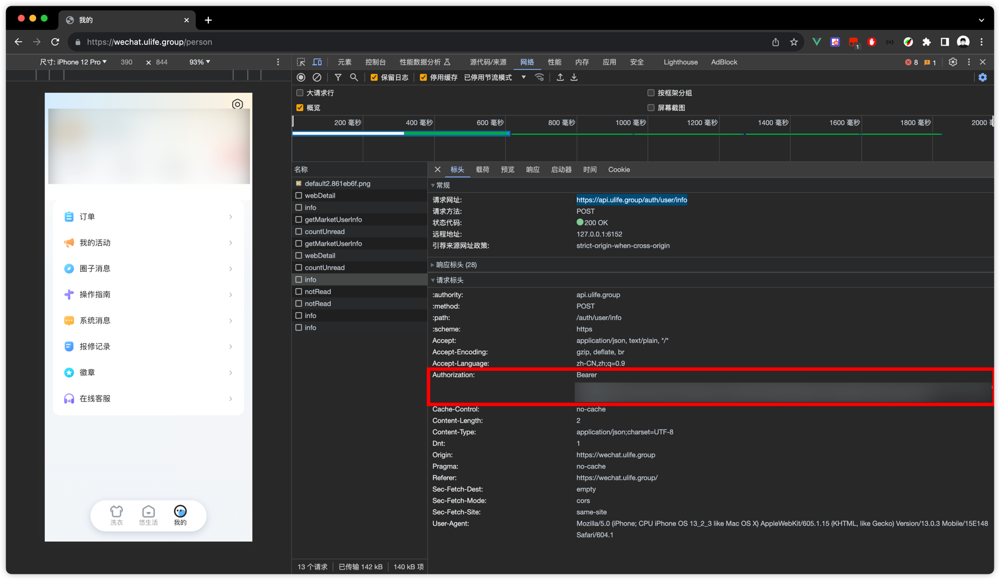

<div align="center">
    
</div>
<p align="center" style="font-size: 21px">X1a0He</p>
<p align="center">2023@MacBook Pro</p>

# 概览

<!-- TOC -->
* [概览](#概览)
* [支持](#支持)
* [青龙面板环境变量解释](#青龙面板环境变量解释)
* [使用](#使用)
* [运行顺序/逻辑](#运行顺序逻辑)
* [authorization获取教程](#authorization获取教程)
* [功能](#功能)
* [更新日志](#更新日志)
<!-- TOC -->

# 支持
* [x] 青龙面板
* [x] 本地执行
    * 需要node环境，必须
    * 需要安装 yarn 或者 npm 或者 cnpm 或者 pnpm
    * 可能需要代码编辑器(不是编译器)
# 青龙面板环境变量解释

<details> 
    <summary>BARK_PUSH</summary><br>
    Bark推送ID
</details>
<details> 
    <summary>YOUXI_AUTHORIZATION</summary><br>
    悠洗登录认证值，抓包可得，不会的看下面教程，支持多authorization，即支持多个账号，分别开无痕模式抓就行了<br><br>
    多authorization值请每个authorization用@分隔<br><br>
    authorization1@authorization2@authorization3@.....
</details>
<details> 
    <summary>YOUXI_PET_FEED</summary><br>
    是否喂养宠物，默认为true
    true: 喂养宠物，但保留至少足够一次购买指定ID的宠物粮食的黄色阳光值<br>
    false: 不喂养宠物
</details>
<details> 
    <summary>YOUXI_PET_FOOD_ID</summary><br>
    默认为 3 ，即喂养双层牛排，消耗9点黄色阳光值，获得10点经验<br><br>
    宠物粮食ID，2023-09-21 的宠物粮食ID分别如下<br>
    0 - 鸡腿 - 消耗 3 点黄色阳光值 - 获得 1 点经验值<br>
    1 - 猫狗粮 - 消耗 5 点黄色阳光值 - 获得 5 点经验值<br>
    2 - 双层牛排 - 消耗 9 点黄色阳光值 - 获得 10 点经验值<br>
    3 - 三文鱼大 - 消耗 2 点紫色阳光值 - 获得 15 点经验值(不建议用，因为消耗紫色阳光值)<br><br>
</details>
<details> 
    <summary>YOUXI_GOLD_PRESERVE</summary><br>
    黄色阳光值预保留值，即经过一系列扣除黄色阳光值后，必须保留X点<br><br>
    默认值为9，即可购买一份宠物粮食，但若当前只剩下9点黄色阳光值，则不会喂养宠物，详情流程会详细说
</details>
<details> 
    <summary>YOUXI_VIOLET_PRESERVE</summary><br>
    紫色阳光值预保留值，即经过一系列扣除紫色阳光值后，必须保留X点<br><br>
    ⚠️由于当前未实现洗衣折扣券兑换，即未实现扣除紫色阳光值的功能，所以该环境变量不设置也罢<br>
    默认值为28，即一张最低的洗衣折扣券的价值
</details>

# 使用
* 打开终端，逐行输入以下命令
```bash
git clone https://github.com/X1a0He/ulife-youxi.git
yarn
# 上面这个yarn可以替换成 npm i 或者 pnpm i，这行不用输入
```
* 等待安装完毕后，找到脚本的xh_config -> authorization 最后的\[\]，里面输入你的authorization值，[怎么获取？](#authorization获取教程)
* 填入authorization值后，终端输入以下命令即可
```bash
node youxi
```
# 运行顺序/逻辑
```
整体脚本逻辑大概如下
1. 先获取个人信息，黄色阳光值，紫色阳光值以及用户名
2. 检测今天是否已经签到，没签到就签到，签到了就跳过
3. 签到完之后，【完成签到】任务可领取10g黄色阳光值，不着急
4. 先获取一遍空间情况
    a. 先回收掉所有的能量
    b. 回收掉挂在外面的所有衣服
    c. 查看洗衣机状态，有衣服就晾，没有就下一步
    d. 洗衣机状态为空，有脏衣服就洗，没有就下一步
5. 因为任务里有一个兑换优惠券的任务，而兑换宠物食物也算完成这个任务，所以先做宠物部分
6. 因为任务里有一个收获黄色阳光值50和100，偷好友阳光值可能会完成这个任务，所以先做好友
7. 查看任务完成状态，能领取就领取

不管是路人还是好友，统一帮忙完成空间任务
0. 不管那么多，先偷了阳光值再说
1. 回收好友挂出来的衣服(防止等下洗衣服之后没有位置挂)，上限了就不管了
2. 看好友的洗衣机状态，如果里面有衣服，就帮忙晾，没有就下一步
3. 此时，洗衣机状态为空，检测是否有脏衣服，有就送洗并晾晒，没有则进行下一步
4. 晾晒完肯定产生阳光值，那就重回0，不过需要等待5分钟，那就有缘下次再相会
```
# authorization获取教程
* 电脑浏览器打开（大学生别跟我说没电脑）[https://wechat.ulife.group/person](https://wechat.ulife.group/person) 后按F12把调试工具打开，还不会的话，右键页面随意地方，找到最下面的"检查"即可
  
* 用手机验证码登录，不用我教了吧
* 登录成功后，先把右边的调试工具点到网络(network)，然后点下面的"我的"
  
* 点countUnread下面的info后，右边看到网址是[https://api.ulife.group/auth/user/info](https://api.ulife.group/auth/user/info)，即可(其实随便一个info都可以)
* 往下看就可以看到Authorization
  
* 把Bearer开头的一整串丢到环境变量YOUXI_AUTHORIZATION即可
# 功能
- [x] Bark消息发送
- [x] 领券中心
    - [x] ✅ 查询可领取的优惠券数量
    - [x] ✅ 领取优惠券
- [x] 关注板块
    - [x] ✅ 取消关注好友
- [x] 个人信息获取(事实上支持更多，但以下三个比较重要)
    - [x] ✅ 黄色阳光值
    - [x] ✅ 紫色阳光值
    - [x] ✅ 优惠券数量
- [ ] 悠生活个人板块
    - [x] ✅ 脏衣服
        - [x] ✅ 数量获取
        - [x] ✅ 清洗脏衣服
    - [x] ✅ 洗衣机
        - [x] ✅ 状态获取
        - [x] ✅ 完成清洗的衣服晾晒
    - [x] ✅ 衣架
        - [x] ✅ 状态获取
        - [x] ✅ 黄色/紫色能量收获
        - [x] ✅ 晾晒完毕的衣服回收
    - [x] 衣柜
        - [x] ✅ 稀有衣服解锁(需要满足达到指定魅力值)
        - [ ] ⚠️ 传说衣服解锁(因需要消耗紫色阳光值，所以未完成该功能)
- [ ] 悠生活他人板块
    - [x] ✅ 脏衣服
        - [x] ✅ 数量获取
        - [x] ✅ 清洗脏衣服
    - [x] ✅ 洗衣机
        - [x] ✅ 状态获取
        - [x] ✅ 完成清洗的衣服晾晒
    - [x] ✅ 衣架
        - [x] ✅ 状态获取
        - [x] ✅ 黄色能量偷取(紫色能量仅主人可收获)
        - [x] ✅ 晾晒完毕的衣服回收
- [x] 悠生活任务板块
    - [x] ✅ 每日签到
    - [x] ✅ 领取任务完成后的黄色阳光值
- [ ] 兑换板块
    - [ ] ⚠️ 洗衣折扣券兑换(后续将会支持，不着急)
    - [ ] ⚠️ 紫色阳光虚拟服装兑换(优先级不高)
    - [ ] ❌ 黄色阳光专区(没必要，不会支持)
- [ ] ❌ 榜单板块(无意义，不会支持)
- [ ] ❌ 动态板块(无意义，不会支持)
# 更新日志
- 2023-09-28 08:55 Update [youxi.js](https://github.com/X1a0He/ulife-youxi/blob/main/youxi.js)
```
新增退出登录功能，该功能已被注释，有需要的可以解开注释使用，Line 52 - 55
```
- 2023-09-27 13:15 Update [youxi.js](https://github.com/X1a0He/ulife-youxi/blob/main/youxi.js)
```
1. 新增查询领券中心可领取的优惠券数量
2. 新增领取优惠券功能
3. 新增取消关注好友功能，每次执行脚本至少会取关20个好友

注意:
好友取关功能如果需要取关更多，请提issues，说明情况
比如
1. 能不能加一个功能过滤好友名字不取关
2. 能不能加一个功能如果是互关的好友就不取关
3. 我想取关所有的好友，但是我不想执行那么多次脚本，可以一次执行全部取关吗
```
- 2023-09-20 23:40 Create [youxi.js](https://github.com/X1a0He/ulife-youxi/blob/main/youxi.js)
```
悠洗洗衣App日常脚本已上传，具体支持请看 #功能
```
- 2023-09-20 23:40 Create [Repo](https://github.com/X1a0He/ulife-youxi)
```
创建仓库，先把README.md写好，把饼先画好
```


